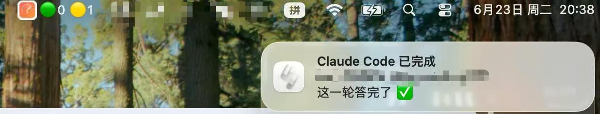

# CC Monitor

一个常驻 macOS 菜单栏的小工具,用来**实时监控多个同时运行的 Claude Code 会话**——哪个还在跑、哪个已经答完、哪个在等你授权,一眼看清,答完即推送通知。

> 解决的真实痛点:同时开很多个 Claude Code CLI 时,它们结束时间不一,你不知道哪个什么时候完事,只能反复切窗口看。

## 它长什么样

菜单栏显示汇总计数(🟢运行中 / 🟡待处理 / 🔴需介入),点开看到每个会话的状态:

```
🟢2 🟡1
─────────────────────────
运行中 2 · 待处理 1 · 需介入 0
🟢 web-api            [RUNNING · 3s · hook]
🟡 ml-train           [WAITING · 12s · hook]
🔴 infra              [NEEDS_INPUT · 5s · hook]
退出 CC Monitor
```

## 核心设计:Hook 确定性事件 + 日志兜底

这是本项目最值得说的地方。监控"一个会话停没停"有两种思路:

| 方案 | 优点 | 缺点 |
|---|---|---|
| 读日志猜(早期版本) | 不侵入、CC 升级不易挂 | 靠"静默时长"猜,**长耗时工具会误报成"已结束"** |
| Hook 主动上报(当前) | CC 在停下的那一刻**确定性**告诉你 | 需要注册 hook |

最初用读 `~/.claude/projects/*.jsonl` 日志、靠静默秒数推断状态,但发现根本缺陷:**"沉默"分不清是"真的结束了"还是"工具跑得慢"**。于是改用 Claude Code 的 [Hooks](https://docs.claude.com/en/docs/claude-code/hooks):`Stop` 事件 = 这一轮真的答完了,`Notification` = 需要授权/输入,`SessionEnd` = 会话结束。日志解析降级为**兜底**(对没装 hook 的会话仍可用)。

```
多个 CC 会话 ──Stop/Notification 等事件──▶ cc_hook.py ──写──▶ ~/.cc-monitor/state.db
                                                                      ▲ │
没装 hook 的会话 ──日志启发式兜底──────────────────────────────────────┘ ▼
                                                          cc_monitor.py 菜单栏(读库+去重通知)
```

职责分离:`cc_hook.py` 只管"快、准、写库";`cc_monitor.py` 统一聚合、去重、弹通知。通知去重用 DB 的 `notify_pending` 字段做**边沿触发**——状态切换才弹一次,重启不丢、抖动不重复弹。

> **关于安全性:这个 hook 绝不会卡住你的 Claude Code。** `install_hooks.py` 注册时做了两道保险:① 把 `cc_hook.py` 复制到固定位置 `~/.cc-monitor/cc_hook.py` 再注册,项目源码以后随便删/移/改名都不影响;② 注册的命令以 `|| true` 结尾,即便那个固定副本也被删了,命令仍返回 0,`UserPromptSubmit` 不会被拦、你照样能正常发消息。监控属于非关键 hook——宁可漏报一次,也绝不阻断 CC。

## 安装

```bash
pip3 install rumps        # 唯一依赖(仅菜单栏 UI;核心逻辑零依赖)
python3 install_hooks.py  # 注册 hook 到 ~/.claude/settings.json
# 重启你的 Claude Code 会话,hook 才生效
python3 cc_monitor.py     # 常驻菜单栏
```

> 没装 rumps 时,`cc_monitor.py` 会自动降级为终端模式(清屏刷新列表),照样能用。

## 打包成 .app(可选,长期使用)

```bash
./build_app.sh            # 产物 dist/CCMonitor.app,拖进 /Applications 双击即用
```

⚠️ **别用 conda 的 Python 打包**(见下方踩坑记录),`build_app.sh` 会自动挑选非 conda 的 Python。

## 卸载

```bash
python3 uninstall.py      # 移除 hook + 删状态库
pkill -f cc_monitor       # 退出菜单栏 App
# 装过 .app 的话,把 /Applications/CCMonitor.app 拖进废纸篓
```

## 文件说明

| 文件 | 作用 |
|---|---|
| `cc_monitor.py` | 菜单栏 App 主程序(读库、聚合、去重通知、日志兜底) |
| `cc_hook.py` | Hook 上报端,被 CC 调用,确定性写入状态库 |
| `install_hooks.py` / `uninstall.py` | 注册 / 卸载 hook |
| `setup.py` / `build_app.sh` | py2app 打包(及一键脚本) |
| `CCMonitor.spec` / `build_app_pyinstaller.sh` | PyInstaller 打包(备选方案) |
| `fix_libffi.sh` | 修复 conda 打包导致的 libffi 缺失 |
| `make_icons.py` | 从源图生成图标 |
| `AppIcon.icns` / `menubar_color*.png` | 应用图标 / 菜单栏图标 |

## 踩坑记录

记录开发中遇到的几个真实问题,供参考:

1. **长耗时工具误报**:早期靠静默时长判断状态,一个跑 40s 的测试工具会被误判成"已结束"。根因是"沉默"无法区分"结束"和"慢" → 改用 hook 确定性事件解决。
2. **`.app` 启动即崩,`libffi.8.dylib` not loaded**:用 conda 的 Python 打包时,`_ctypes.so` 依赖 conda 自带的游离 dylib,而打包器没收集它。解决:改用 Homebrew 的 Python;或用 `fix_libffi.sh` 把 dylib 拷进 .app 并改 rpath。
3. **菜单里没有"退出"项**:`tick()` 每次 `menu.clear()` 重建菜单时把 rumps 默认退出按钮也清掉了。解决:关掉自动退出键,每次重建手动补回退出项。
4. **菜单栏图标看着像空白方块**:模板图标的线条太细,18px 下几乎不可见。解决:改用彩色 app 图标缩放版(`template=False`)。
5. **移动/删除项目目录后,CC 发不出消息了**:早期 hook 注册的是项目里的绝对路径,目录一移/一删,`UserPromptSubmit` hook 找不到脚本→非零退出→**直接拦截你的输入**。注意脚本内部的 try/except 此时根本来不及执行(失败发生在"脚本还没启动起来"那一层)。解决:① 注册时把 `cc_hook.py` 复制到固定位置 `~/.cc-monitor/cc_hook.py`,与项目源码解耦;② 命令尾部加 `|| true` 兜底,文件即便丢了也不阻断 CC。

## 依赖与环境

- macOS(菜单栏 App 依赖系统 API)
- Python 3
- `rumps`(菜单栏 UI,核心逻辑不依赖)
- Claude Code(需支持 Hooks)

## 说明
如果遇到了 hook 问题导致 CC 无法问答，请使用如下脚本清除 hook 配置：
``` bash
python3 - <<'EOF'
import os, json, shutil, time
p = os.path.expanduser("~/.claude/settings.json")
if not os.path.exists(p):
    print("settings.json 不存在,无需处理"); raise SystemExit
shutil.copy(p, p + f".bak.{int(time.time())}")   # 先备份,后悔了能还原
cfg = json.load(open(p))
had = "hooks" in cfg
cfg.pop("hooks", None)
json.dump(cfg, open(p, "w"), indent=2, ensure_ascii=False)
print("✅ 已清空所有 hooks(原配置已备份为 .bak)" if had else "本来就没有 hooks")
EOF
```


## 演示
常驻状态：

完成通知：
