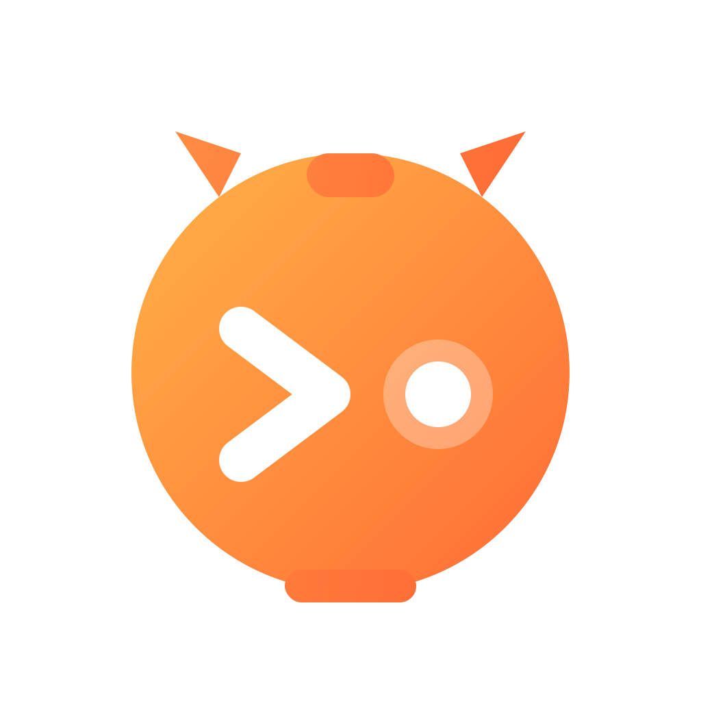
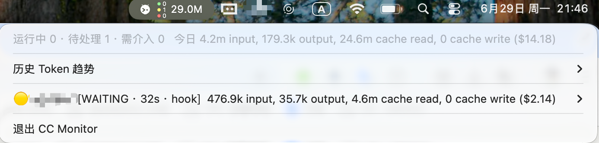
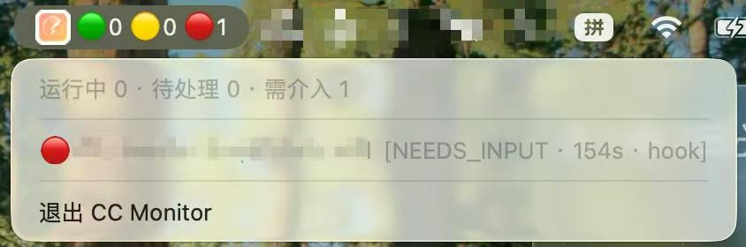
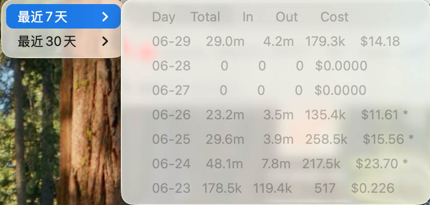
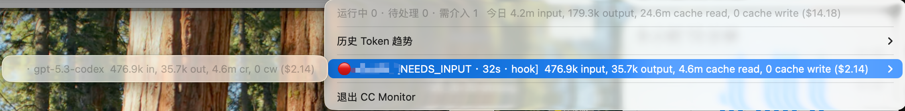

<div align="center">
  
  <h1>CC Monitor</h1>
  <p>macOS 菜单栏里的 Claude Code 多会话状态与 Token 监控工具</p>
</div>

<p align="center">
  <code>platform: macOS</code>
  <code>python: 3.x</code>
  <code>ui: rumps</code>
  <code>storage: SQLite</code>
</p>

<div align="center">
  
</div>

> 解决多开 Claude Code 会话时“哪个结束了、哪个在等我、哪个需要介入”难以追踪的问题。

---

## Why CC Monitor

当你同时开多个 Claude Code CLI，会话结束时间不一致、窗口频繁切换会很低效。CC Monitor 提供：

- 菜单栏实时总览（RUNNING / WAITING / NEEDS_INPUT）
- 会话级别状态列表与活跃时长
- Token / 成本统计（含按模型明细）
- 会话完成或需要输入时的桌面通知

---

## Core Design

CC Monitor 采用 **Hook 确定性事件 + 日志兜底** 的混合架构：

- `cc_hook.py`：由 Claude Code hooks 调用，快速写入 `~/.cc-monitor/state.db`
- `cc_monitor.py`：常驻读取 DB，统一聚合展示并处理通知去重
- 日志兜底：对未安装 hook 的会话，从 transcript 启发式推断状态

```text
Claude Code Sessions
   ├─ Hook events (Stop/Notification/...) ──> cc_hook.py ──> ~/.cc-monitor/state.db
   └─ Transcript fallback (.jsonl) ───────────> cc_monitor.py (merge)
                                                   └─ Menubar + Notifications
```

通知采用 DB `notify_pending` 做边沿触发，避免重复弹窗且支持重启后状态保持。

---

## Quick Start

```bash
pip3 install rumps
python3 install_hooks.py
# 重启 Claude Code 会话，使 hooks 生效
python3 cc_monitor.py
```

说明：

- 未安装 `rumps` 时，`cc_monitor.py` 会自动降级为终端模式。
- 若希望点击通知优先唤起对应终端客户端，可安装：

```bash
brew install terminal-notifier
```

---

## Installation

### 1) 安装依赖

```bash
pip3 install rumps
```

### 2) 安装 hooks

```bash
python3 install_hooks.py
```

### 3) 启动监控

```bash
python3 cc_monitor.py
```

---

## Token & Pricing

- Token 来自 transcript `usage` 字段，兼容 Anthropic/OpenAI 常见映射
- 去重策略兼容 ccusage 思路：优先 `(message_id, request_id)`，再做 message 级归并
- 会话累计字段：
  - `tok_input`
  - `tok_output`
  - `tok_cache_write`
  - `tok_cache_read`
  - `tok_total`
- 成本字段：`cost_usd`
- 若出现未知模型价格，标记 `cost_known=0`（token 仍可准确统计）
- 价格来源：
  - 内置：`prices.builtin.json`
  - 用户覆盖：`~/.cc-monitor/prices.json`（示例：`prices.json.example`）

---

## Build App (.app)

```bash
./scripts/build_app.sh
```

产物：`dist/CCMonitor.app`

> 建议使用脚本默认选择的非 conda Python 环境打包，避免动态库问题。

---

## Uninstall

```bash
python3 uninstall.py
pkill -f cc_monitor
# 若安装过 .app：删除 /Applications/CCMonitor.app
```

---

## Project Structure

| File | Purpose |
|---|---|
| `cc_monitor.py` | 菜单栏主程序：聚合、展示、通知与兜底逻辑 |
| `cc_hook.py` | Hook 写库端：接收事件并更新会话状态 |
| `cc_pricing.py` | Token 解析、去重、计费聚合 |
| `install_hooks.py` | 安装 hooks（稳定副本路径 + 容错命令） |
| `uninstall.py` | 卸载 hooks 与状态库 |
| `setup.py` / `scripts/build_app.sh` | py2app 打包 |
| `CCMonitor.spec` / `scripts/build_app_pyinstaller.sh` | PyInstaller 打包（备选） |

---

## Safety Notes

本项目的 hook 设计目标是：**不阻断 Claude Code 正常使用**。

- 安装时将 `cc_hook.py` 复制到稳定路径：`~/.cc-monitor/cc_hook.py`
- 注册命令尾部使用 `|| true`，即便脚本缺失也不阻断输入
- hook 进程内部异常吞掉并 `exit 0`

若你遇到 hook 配置异常导致会话异常，可先清理 hooks 后重装：

```bash
python3 - <<'EOF'
import os, json, shutil, time
p = os.path.expanduser("~/.claude/settings.json")
if not os.path.exists(p):
    print("settings.json 不存在,无需处理"); raise SystemExit
shutil.copy(p, p + f".bak.{int(time.time())}")
cfg = json.load(open(p))
cfg.pop("hooks", None)
json.dump(cfg, open(p, "w"), indent=2, ensure_ascii=False)
print("✅ 已清空 hooks（已备份）")
EOF
```

---

## Screenshots

**Menubar**



**Notification**


**Token**

---
