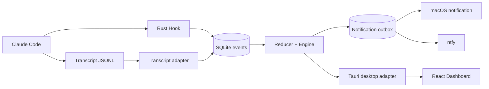

<div align="center">


# CC Monitor

macOS 菜单栏中的 Claude Code 会话状态、通知与 Token 用量监控工具。

**Tauri 2 · Rust · React · SQLite**

</div>

## 功能

- 菜单栏显示最近 24 小时的会话状态、会话编号与 Token 用量
- Dashboard 提供会话详情、历史趋势、设置和诊断
- 模型定价以一个列表提供添加、编辑和删除，并支持重新扫描重算历史费用
- Claude Code Hook 采集确定性事件，Transcript 提供状态和用量补充
- macOS 桌面通知与可选 ntfy 远程通知
- 点击通知或会话菜单可返回对应会话
- 异步历史索引、进度反馈及安全的数据维护

## 架构


```mermaid
flowchart LR
    Claude["Claude Code"] --> Hook["Rust Hook"]
    Claude --> Transcript["Transcript JSONL"]
    Hook --> Events[("SQLite events")]
    Transcript --> Adapter["Transcript adapter"]
    Adapter --> Events
    Events --> Engine["Reducer + Engine"]
    Engine --> Outbox[("Notification outbox")]
    Engine --> Tauri["Tauri desktop adapter"]
    Outbox --> Desktop["macOS notification"]
    Outbox --> Ntfy["ntfy"]
    Tauri --> React["React Dashboard"]
```

当前架构约束与产品行为见
[`docs/architecture.md`](docs/architecture.md)。

## 项目结构

```text
CC-Monitor/
├── src/                    React 界面与按功能组织的纯前端逻辑
│   └── features/           历史统计、模型定价等功能模块
├── src-tauri/              Tauri 命令、桌面生命周期和 macOS 适配
├── crates/
│   ├── monitor-domain/     领域类型与唯一的会话状态 reducer
│   ├── monitor-engine/     有界事件处理与后台任务编排
│   ├── monitor-storage/    SQLite 仓储和有序数据库迁移
│   ├── monitor-notify/     桌面及 ntfy 通知投递
│   └── adapter-claude/     Claude Code Hook 与 Transcript 适配
├── contracts/              Rust 与 TypeScript 共享的语言无关契约
├── tests/fixtures/         跨模块测试夹具
├── scripts/                验证、构建和发布辅助脚本
├── deploy/                 用户安装与部署脚本
└── docs/                   架构、验收与数据库参考
```

依赖方向以 Rust 核心独立于 Tauri 为原则：`src-tauri/` 只负责把桌面系统与
核心 crates 接起来。

## 开发环境

- macOS
- Rust 1.88 或更高版本
- Bun
- Tauri CLI 2

使用 `mise` 时：

```sh
mise install
```

按锁文件安装前端依赖：

```sh
mise run bootstrap
```

## 开发与构建

启动开发版本：

```sh
mise run dev
```

运行前端测试：

```sh
mise run test-ui
```

运行完整源码验证：

```sh
mise run verify
```

运行 Rust 工作区测试：

```sh
mise run test
```

检查 Rust 格式和 lint：

```sh
mise run format
mise run lint
```

构建 macOS 应用：

```sh
mise run build
```

该命令使用本机已安装且受 Rust 工具链管理的 `cargo tauri`，不会在构建时
临时下载或解析另一个 CLI 版本；仓库的 mise 工具定义固定为已验收的
Tauri CLI 2.11.4。

发布前可用一个命令依次执行完整验证和本地打包：

```sh
mise run verify-release
```

发布门禁要求工作区没有已修改或未跟踪文件，并在开始时输出准确的 Git commit；
开发过程中仍可直接使用 `mise run build` 构建尚未提交的改动。

本地包面向执行构建命令的 Mac 架构，主程序与 Hook 会在打包时校验为相同
架构；当前流程不生成 universal2 分发包。

本地产物使用 ad-hoc 签名并验证 `com.ccmonitor` 标识，适合本机验收；
它不等同于 Developer ID 签名和 Apple 公证的分发版本。原生通知、状态栏、
键盘和 VoiceOver 验收矩阵见
[`docs/local-acceptance.md`](docs/local-acceptance.md)。

产物位于：

```text
target/release/bundle/macos/CC Monitor.app
```

完整验证和本地打包会生成数 GB 的可再生 Rust 产物。不再需要调试缓存或本地
应用包时，可安全释放这些文件：

```sh
mise run clean
```

## 数据与隐私

- 应用数据库位于 macOS Application Support 目录。
- Transcript 正文不会写入应用数据库或日志。
- ntfy 凭据仅保存在本地 SQLite，不进入日志或诊断报告。
- ntfy 公网及非本机地址必须使用 HTTPS。HTTP 只允许无凭据的
  `localhost`、`127.0.0.1` 或 `::1` 本机测试服务。
- 首次索引和历史重放不会创建用户通知。
- 应用不会删除或迁移旧版 `~/.cc-monitor/state.db`。

## 测试夹具

`tests/fixtures/` 是 Rust 适配器和 reducer 使用的语言无关契约数据，
其中只包含为本项目创建的合成内容。
