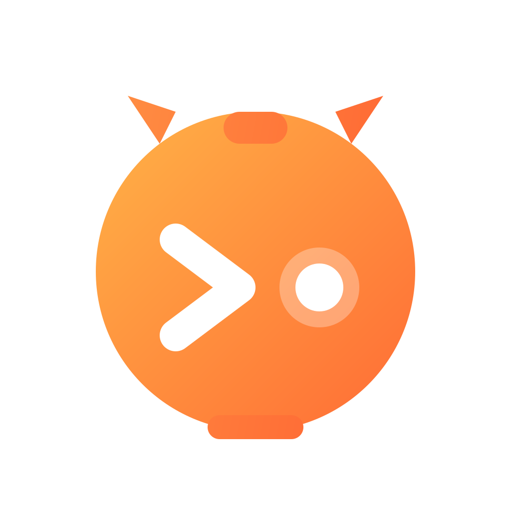
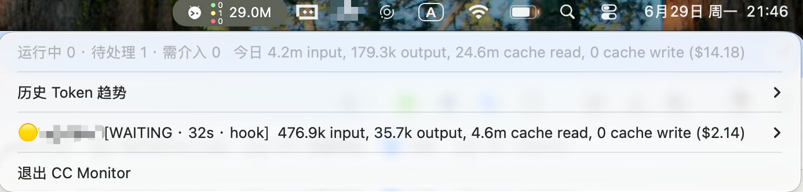
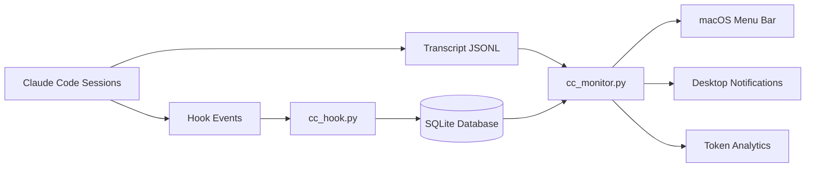
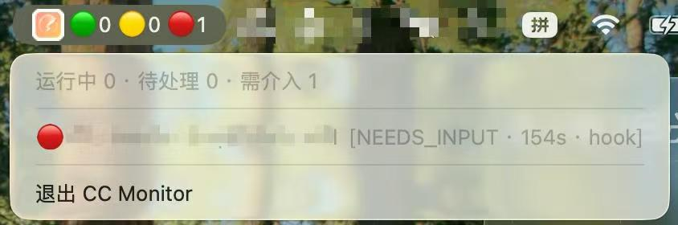
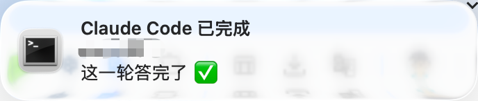
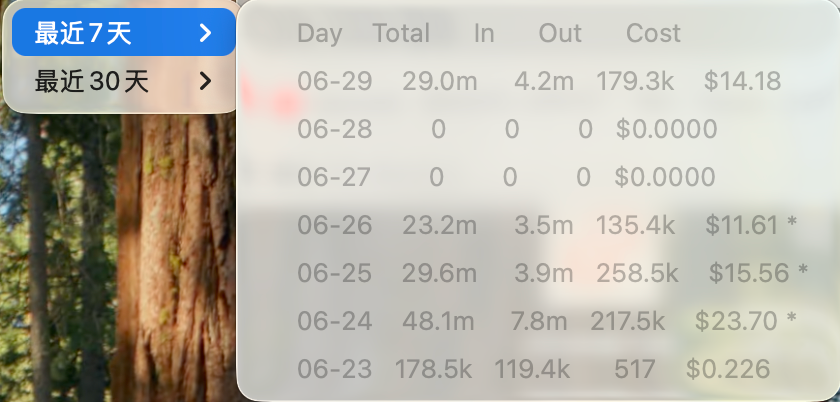
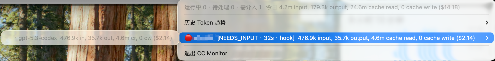

<div align="center">



<h1>CC Monitor</h1>

<p>
  macOS 菜单栏里的 Claude Code 多会话状态与 Token 监控工具
</p>

<p>
  Monitor multiple Claude Code sessions from your macOS menu bar.
</p>

<p>
  <a href="https://github.com/expAdd3/CC-Monitor/stargazers">
    
  </a>
  <a href="https://github.com/expAdd3/CC-Monitor/releases">
    
  </a>
  <a href="https://github.com/expAdd3/CC-Monitor/blob/main/LICENSE">
    
  </a>
  
  
</p>

<br>



</div>


## ✨ Overview

CC Monitor is a lightweight macOS menu bar application designed for developers who run multiple Claude Code CLI sessions simultaneously.

It provides real-time visibility into:

- Which sessions are running
- Which sessions are waiting for input
- Which sessions need attention
- Token consumption and estimated cost
- Session completion notifications


---

# ✨ Features


### 🖥 Menu Bar Monitoring

View all Claude Code sessions directly from the macOS menu bar.

Supported states:

- `RUNNING`
- `WAITING`
- `NEEDS_INPUT`


### 🔔 Smart Notifications

Receive desktop notifications when:

- A session completes
- Claude Code requires user interaction
- A session state changes

Remote push notifications can also be configured directly in **Settings →
Remote Notifications**. CC-Monitor supports self-hosted
[ntfy](deploy/README.md), sends without blocking the menu-bar refresh loop, and
keeps credentials in `~/.cc-monitor/notify.json`.
The ntfy topic is derived from the username as `{username}-cc-monitor`.


### 📊 Token & Cost Analytics

Track:

- Input tokens
- Output tokens
- Cache write tokens
- Cache read tokens
- Total usage
- Estimated cost per model


### 🧩 Reliable Event Tracking

Hybrid monitoring architecture:

- Claude Code Hooks for deterministic events
- Transcript fallback for compatibility
- SQLite persistent storage


### 🛡 Safe Hook Design

Hooks are designed to never interrupt Claude Code:

- Independent execution
- Failure isolation
- Automatic fallback
- Persistent state storage


---

# 🏗 Architecture



```mermaid
flowchart LR

A[Claude Code Sessions]

A --> B[Hook Events]
A --> C[Transcript JSONL]

B --> D[cc_hook.py]

D --> E[(SQLite Database)]

C --> F[cc_monitor.py]

E --> F

F --> G[macOS Menu Bar]

F --> H[Desktop Notifications]

F --> I[Token Analytics]
```


CC Monitor uses a **Hook + Transcript hybrid architecture**:


```
Claude Code Sessions

    |
    |-- Hook events
    |       |
    |       v
    |   cc_hook.py
    |       |
    |       v
    |   ~/.cc-monitor/state.db
    |
    |
    |-- Transcript fallback
            |
            v
       cc_monitor.py

            |
            +---- Menu Bar
            |
            +---- Notifications
            |
            +---- Token Statistics
```


Notification state uses database persistence to avoid duplicate notifications and survive application restarts.


---

# 🚀 Quick Start


## Install dependencies

```bash
pip3 install rumps
```


## Install Claude Code Hooks

```bash
python3 install_hooks.py
```


Restart Claude Code sessions after installation.


## Start Monitor

```bash
python3 cc_monitor.py
```


If `rumps` is unavailable, CC Monitor automatically falls back to terminal mode.


Optional:

Install `terminal-notifier` for better notification interaction:

```bash
brew install terminal-notifier
```


---

# 📦 Installation


Clone repository:

```bash
git clone https://github.com/expAdd3/CC-Monitor.git

cd CC-Monitor
```


Install:

```bash
pip3 install rumps

python3 install_hooks.py

python3 cc_monitor.py
```


---

# 📊 Token & Pricing


Token information is extracted from Claude Code transcript usage data.


Supported fields:

| Field | Description |
|-|-|
| `tok_input` | Input tokens |
| `tok_output` | Output tokens |
| `tok_cache_write` | Cache write tokens |
| `tok_cache_read` | Cache read tokens |
| `tok_total` | Total tokens |
| `cost_usd` | Estimated cost |


Pricing system:

- Built-in pricing:
  - `prices.builtin.json`

- User override:

```
~/.cc-monitor/prices.json
```


Unknown models:

```
cost_known = 0
```

Token statistics remain available even without pricing information.


---

# 🔨 Build Application


Build macOS `.app`:


```bash
./scripts/build_app.sh
```


Output:

```
dist/CCMonitor.app
```


Recommended:

Use the script-selected system Python environment instead of conda Python to avoid dynamic library issues.


---

# 🗑 Uninstall


```bash
python3 uninstall.py

pkill -f cc_monitor
```


If installed:

```
/Applications/CCMonitor.app
```

Remove the application manually.


---

# 📁 Project Structure


```
CC-Monitor

├── cc_monitor.py
│   Main menu bar application

├── cc_hook.py
│   Claude Code hook receiver

├── cc_pricing.py
│   Token parsing and cost calculation

├── install_hooks.py
│   Hook installation

├── uninstall.py
│   Cleanup utility

├── setup.py
│   py2app configuration

├── scripts/
│   └── build_app.sh
│       Application builder

└── assets/
    ├── app_icon_color.svg
    └── screenshots
```


---

# 🔒 Safety Notes


CC Monitor hooks are designed with a non-blocking principle.


During installation:

- Hook script is copied to a stable path:

```
~/.cc-monitor/cc_hook.py
```


- Hook commands use:

```bash
|| true
```


- Internal errors are isolated
- Hook always exits successfully


If Claude Code behaves unexpectedly after installing hooks:

Backup and clear hooks:


```bash
python3 - <<'EOF'
import os
import json
import shutil
import time

p = os.path.expanduser("~/.claude/settings.json")

if not os.path.exists(p):
    print("settings.json not found")
    raise SystemExit

shutil.copy(
    p,
    p + f".bak.{int(time.time())}"
)

cfg = json.load(open(p))

cfg.pop("hooks", None)

json.dump(
    cfg,
    open(p, "w"),
    indent=2,
    ensure_ascii=False
)

print("Hooks cleared successfully")
EOF
```


---

# 📸 Screenshots


## Menu Bar




## Notification




## Token Overview




## Token Details




---

# ❤️ Support


If CC Monitor helps your Claude Code workflow, consider giving the project a ⭐ on GitHub.


---

<div align="center">

Built for developers running multiple Claude Code sessions.

</div>
