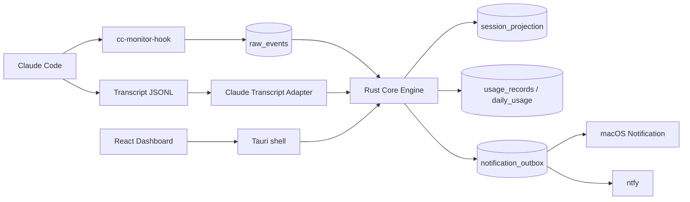

# CC-Monitor Tauri + Rust Refactor Specification

Status: approved for implementation planning
Target: local development first; GitHub Release later
Initial platform: Claude Code on macOS 12+

## 1. Objective

Replace the Python/rumps application with a Tauri 2 desktop application backed
by a Rust core, while improving the UI and preserving the useful behavior of
the current menu-bar product.

The first release is not a generic agent platform. It supports Claude Code on
macOS. The architecture may admit later adapters, but Codex, Gemini, Windows,
Linux, remote agents, and remote control are out of scope.

Success means:

- Hook execution cannot block Claude Code.
- Session and turn status are derived consistently from Hook and Transcript
  evidence.
- Token and cost calculations retain the current observable behavior.
- The existing menu-bar information architecture remains available.
- A Dashboard adds session detail, history, settings, and diagnostics.
- Local and ntfy notifications are idempotent.
- Closing the Dashboard does not stop monitoring; explicitly quitting does.
- The Rust core can be tested without a Tauri runtime.

## 2. Approved product decisions

| Topic | Decision |
|---|---|
| Scope | Claude Code + macOS only |
| UI | Tauri 2 + React + TypeScript |
| Menu | Preserve current summary, trends, session submenus, settings, and quit |
| Dashboard | Primary surface for details, charts, settings, and diagnostics |
| CLI | No user-facing fallback; keep a diagnostic CLI |
| Old database | Application does not migrate, delete, or inspect it |
| New database | Fresh SQLx/SQLite database in Tauri's app data directory |
| First index | Scan all existing Claude transcripts; never notify during indexing |
| Active window | Show sessions active within the last 24 hours |
| Old configuration | Do not migrate; users configure the new application |
| App quit | No realtime notification or transcript work after explicit quit |
| Hook while quit | Short-lived Hook may continue appending raw events |
| Restart notices | Suppress old Done notices; notify unresolved NeedsInput once |
| Notification sequence | NeedsInput and subsequent Done may each notify |
| Terminal navigation | Activate the terminal application; exact tab/pane is not promised |
| ntfy credentials | Plaintext in local SQLite is accepted |
| Pricing | Bundled catalog, no network lookup, editable through UI |
| Telemetry | None |
| Distribution | Local testing first; GitHub Release later |
| Shadow mode | Not used |
| Python rollback product | Not retained |

The application must not implement automatic deletion of
`~/.cc-monitor/state.db`. The two current users will handle legacy cleanup
manually.

## 3. System boundaries



### Rust core

Owns:

- normalized event model;
- session/turn reducer;
- transcript discovery and incremental ingestion;
- token and cost calculation;
- repositories and transactions;
- notification policy and Outbox;
- startup recovery and retention.

It must not import Tauri types.

### Claude adapter

Owns:

- Claude Hook payload normalization;
- Claude transcript parsing;
- Claude-specific event classifications;
- transcript discovery under `~/.claude/projects`;
- model and usage-field normalization.

### Hook binary

The Hook:

1. reads a bounded JSON payload from stdin;
2. extracts stable identifying fields;
3. inserts a raw event with `INSERT ... ON CONFLICT DO NOTHING`;
4. exits with status 0.

The installed Hook command receives the absolute database path and installation
identifier as arguments. The path is resolved by the desktop application during
installation; the Hook does not attempt to reproduce Tauri path resolution.

It must not run migrations, send network traffic or notifications, calculate
cost, scan files, or derive the final session state. SQLite contention uses a
bounded busy timeout and bounded retry. All failure paths still exit 0.

The application creates and migrates the database before installing the Hook.
If the database or schema is unavailable, the Hook records a bounded diagnostic
message when possible and exits 0.

### Tauri shell

Owns:

- process and engine lifetime;
- native tray menu;
- Dashboard windows;
- macOS activation policy;
- Commands, Events, and capabilities;
- local notification platform adapter;
- autostart integration;
- Hook installation and removal.

Commands provide request/response operations. Events only signal that a
revision changed; the React client then fetches a fresh snapshot. Events are
not the domain event log.

## 4. Domain model

### Normalized event

```rust
pub struct AgentEvent {
    pub id: EventId,
    pub agent: AgentKind,
    pub session_id: SessionId,
    pub source: EventSource,
    pub source_event: String,
    pub occurred_at_ms: i64,
    pub received_at_ms: i64,
    pub sequence: Option<i64>,
    pub dedupe_key: String,
    pub payload_version: i64,
    pub payload: serde_json::Value,
}
```

Each Hook process invocation generates one ingestion UUID before attempting
database work and reuses it across every bounded database retry. UUIDv7 is
preferred so IDs remain roughly sortable. Hook identity and deduplication use
`source + ingestion_id`; two invocations received in the same millisecond
remain distinct, while retrying one invocation is idempotent.
`occurred_at_ms` uses a valid source timestamp when present and otherwise falls
back to `received_at_ms`; Hook payload timestamps are optional.

Transcript identity is
`file_identity + line_start_offset + content_fingerprint`. Replacement changes
the file identity while replaying the same physical line remains idempotent.

Normalized Hook payloads retain only reducer/metadata fields when present:
`notification_type`, `tool_name`, `cwd`, `transcript_path`, and
`client_bundle_id`. Raw tool input, transcript content, and unrelated Hook
fields are not retained.

The Claude transcript adapter emits the canonical reducer event names
`TranscriptAssistantToolUse`, `TranscriptAssistantThinking`,
`TranscriptToolResult`, and `TranscriptAssistantText`. The text event carries
an `idle_ms` integer derived at observation time. These are domain inputs, not
raw JSONL record names; the adapter remains responsible for classification.

For deterministic replay, define `logical_at_ms` as `occurred_at_ms` only when
it is positive and within ±24 hours of `received_at_ms`; otherwise use
`received_at_ms`. Events are totally ordered by:

```text
(logical_at_ms,
 source_priority,     # transcript=0, recovery=1, hook=2
 sequence_no_or_i64_max,
 received_at_ms,
 dedupe_key)
```

Hook evidence therefore applies last when sources tie. Inserting an event
before already-projected history triggers replay/reprojection of that session.

### Two-level status

Session lifecycle and current turn state are independent:

```rust
enum SessionLifecycle {
    Active,
    Ended,
}

enum TurnState {
    Running,
    Waiting,
    NeedsInput,
    Failed,
}
```

The projection is keyed by `(agent_kind, session_id)` and also stores
`agent_kind`, `reason`, `source`, `confidence`, `changed_at`, and
`last_observed_at`. A session identifier from one agent must never address the
projection of another agent. UI labels may change without changing these
domain values.

## 5. State transition table

Hook evidence takes precedence over transcript inference while it is recent.
Transcript evidence may recover a session with no usable Hook evidence, but
must not overwrite a definitive recent Hook transition.

“Recent” is frozen as the inclusive 120,000 ms interval after the logical
timestamp of the latest usable Hook event. Transcript transitions at exactly
120,000 ms are suppressed; those after 120,000 ms may infer state. A definitive
Hook `NeedsInput` is stronger than this time window and remains sticky until a
later Hook transition explicitly resolves it or `SessionEnd` occurs.
`UserPromptSubmit`, non-question `PreToolUse`, `PostToolUse`, `auth_success`,
`elicitation_complete`, `elicitation_response`, `StopFailure`, and a new
`SessionStart` are resolving Hook transitions. `Stop`, `idle_prompt`, and
Transcript evidence do not resolve a pending intervention.

| Input | Guard / classification | Lifecycle | Turn state | Notification |
|---|---|---|---|---|
| `SessionStart` | always; may reactivate an ended ID | Active | Waiting | none |
| `UserPromptSubmit` | always | Active | Running | resolve prior pending intervention; start turn |
| `PreToolUse` | `AskUserQuestion` | Active | NeedsInput | NeedsInput on edge |
| `PreToolUse` | other tool | Active | Running | none |
| `PostToolUse` | normal completion | Active | Running | none |
| `Notification` | `permission_prompt` | Active | NeedsInput | NeedsInput on edge |
| `Notification` | `elicitation_dialog` | Active | NeedsInput | NeedsInput on edge |
| `Notification` | `idle_prompt` | Active | Waiting | none |
| `Notification` | `auth_success`, `elicitation_complete`, or `elicitation_response` | Active | Running | none |
| `Notification` | unknown type | Active | NeedsInput | NeedsInput on edge, for forward compatibility |
| `Stop` | unresolved AskUserQuestion | Active | NeedsInput | do not replace intervention with Done |
| `Stop` | otherwise | Active | Waiting | Done only if this turn has no terminal notification |
| `StopFailure` | always | Active | Failed | Failed only if this turn has no terminal notification |
| `SessionEnd` | always | Ended | unchanged for history | none |
| Any Hook event except `SessionStart` | lifecycle is Ended | unchanged | unchanged | none |
| Transcript assistant `tool_use` or `thinking` | no recent Hook truth | Active | Running | none during initial index |
| Transcript `tool_result` | no recent Hook truth | Active | Running | none during initial index |
| Transcript assistant text, modified less than 8 seconds ago | no recent Hook truth | Active | Running | none during initial index |
| Transcript assistant text, idle from 8 through 30 seconds | no recent Hook truth | Active | Running | none during initial index |
| Transcript assistant text, idle more than 30 seconds | no recent Hook truth | Active | Waiting | none during initial index |

The 8/30-second transcript inference thresholds are separate from the approved
24-hour active-list visibility window. The 8–30-second gray zone is
intentionally and conservatively classified as Running to avoid an early
completion signal; this preserves the legacy fallback behavior. Exactly 8 and
exactly 30 seconds are Running. A negative age caused by clock skew is also
conservatively Running.

`SessionEnd` is terminal. Late events remain raw evidence but are ignored by
the reducer until an explicit `SessionStart` reactivates the ID. Within one
turn, the first terminal `Stop` or `StopFailure` wins the notification edge.
Later distinct terminal events may update observation metadata but never
enqueue another terminal notification. `UserPromptSubmit` starts a new turn
and resets this terminal-notified guard.

Reducers must be deterministic and replayable. Duplicate input is ignored.
Out-of-order input is ordered by source timestamp when trustworthy, then source
priority and receipt order. A later replay must produce the same projection and
notification keys.

## 6. Notification policy

Notifications are persisted before delivery.

- Providers: `desktop`, `ntfy`.
- Kinds: `needs_input`, `done`, `failed`.
- A unique transition revision prevents duplicate provider delivery.
- NeedsInput is sent immediately when the state edge occurs.
- Done may follow NeedsInput after the intervention is resolved and the turn
  later stops.
- Initial indexing never creates Outbox rows.
- On restart, historical Done/Failed rows created while the application was not
  running are suppressed.
- On restart, a currently unresolved NeedsInput may notify once.
- Provider failures use bounded retry and retain the last error for diagnostics.
- Secrets and authorization headers never enter logs.

The standard Tauri notification plugin is approved for basic display and
permission handling. Official documentation does not establish a macOS
notification-click callback carrying a session identifier. Terminal activation
therefore requires a technical spike and, if needed, a macOS native
UserNotifications adapter. Exact terminal tab/pane navigation is out of scope.

## 7. Transcript and usage rules

- Discover JSONL below `~/.claude/projects`.
- Initially retain the existing exclusion of internal project directory names
  containing `--`; no user-configurable filter is required.
- First launch indexes all existing transcripts asynchronously.
- Old sessions contribute to usage history but only sessions active in the
  previous 24 hours appear in the active list.
- Store cursors and derived data; do not copy transcript contents into SQLite.
- Tolerate malformed and partial lines, truncation, replacement, and files
  changing during a scan.
- Include related `subagents/*.jsonl` usage.
- Preserve current request/message deduplication behavior.
- Usage identity always includes `agent_kind + session_id`. With both IDs, use
  `(agent, session, message_id, request_id)`; with message ID only, use
  `(agent, session, message_id)` and intentionally collapse main/subagent
  copies; with request ID only, use `(agent, session, request_id)`. With neither
  ID, retain one anonymous-latest slot per agent/session, selected by observed
  timestamp then persisted stable source location. `source_location` is the
  normalized transcript-family-relative file identity plus line-start byte
  offset. File replacement retains stable-ID records and deterministically
  replaces the anonymous slot.
- Count input, output, cache-write, and cache-read tokens.
- `local_day` uses the system timezone active during ingestion. Reindexing
  recomputes local days with the then-current system timezone; the initial
  release does not persist a historical timezone per usage record.
- Unknown pricing retains token counts and marks cost unknown rather than
  guessing.
- The bundled price catalog is authoritative unless overridden through the UI.
  No runtime network price lookup is performed.

## 8. Desktop behavior

### Tray and Dashboard

The tray retains:

- colored running/waiting/needs-input counts;
- today's token and cost summary;
- 7-day and 30-day trends;
- active sessions with per-model usage;
- Settings, open Dashboard, and Quit.

The Dashboard provides richer lists, detail, charts, settings, Hook status,
index progress, reindex, data cleanup, and diagnostics.

Closing the Dashboard intercepts `CloseRequested`, hides the window, and keeps
the engine and tray alive. Tray Quit and `⌘Q` perform real application exit.

On macOS:

- with no Dashboard visible, use `ActivationPolicy::Accessory`;
- before showing Dashboard, use `ActivationPolicy::Regular`;
- after the last Dashboard is hidden, return to `Accessory`;
- Dock pinning remains macOS-owned and is not detected by application logic.

Dynamic Dock, `⌘Tab`, Spaces, and multi-display behavior require manual testing
on supported macOS versions.

### Paths and identity

Use Tauri's Rust path resolver:

```rust
let data_dir = app.path().app_data_dir()?;
let log_dir = app.path().app_log_dir()?;
```

Do not hard-code `~/Library/Application Support/CC Monitor`; Tauri uses the
bundle identifier under the platform application-data directory. The new
application uses `com.lixinyu.ccmonitor`, matching the existing py2app bundle
identity. `com.ccmonitor.app` from the alternative PyInstaller build is retired.
On macOS, Tauri therefore resolves application data beneath:

```text
~/Library/Application Support/com.lixinyu.ccmonitor/
```

Application code still obtains this path from `app.path().app_data_dir()` and
must not construct it from the literal path above.

## 9. Storage and retention

The normative schema is `docs/schema-v2.sql`.

- SQLite uses WAL, foreign keys, `synchronous=NORMAL`, and a 5-second busy
  timeout.
- Only the desktop application runs SQLx migrations.
- The desktop pool uses a 5-second busy timeout. The short-lived Hook instead
  uses a 120 ms SQLite busy timeout with at most two retries after 20 ms and
  40 ms, so contention cannot hold up Claude Code.
- Raw events and successful notification history are retained for 30 days.
- Session projections and daily usage aggregates are retained.
- Transcript contents are not stored.
- Settings and ntfy credentials are stored in SQLite. Credentials are accepted
  as local plaintext and must be masked in UI and omitted from logs/exports.
- Monetary values are persisted as integer pico-USD (`USD × 10^12`). This
  preserves sub-microdollar usage costs without floating-point drift. Catalog
  rates use pico-USD per one million tokens.

## 10. Hook installation ownership

The Rust Hook is copied to the new application support directory. Its command
contains the generated installation identifier and absolute new-database path.
Hook stdin is capped at 256 KiB and must complete within 500 ms. The blocking
read runs on a detached worker; deadline expiry lets the main process exit,
which terminates the blocked reader. Invalid, empty, oversized, or timed-out
input is dropped with a short sanitized diagnostic and a successful process
exit.
Installation:

1. validates and backs up `~/.claude/settings.json`;
2. creates/migrates the new database;
3. installs the signed or locally built Hook binary;
4. removes only recognized legacy CC-Monitor Hook commands;
5. preserves all unrelated hooks;
6. writes the new event registrations atomically.

Atomic replacement preserves the exact Unix mode of an existing settings file;
a newly created settings file is explicitly mode `0600`, independent of the
process umask. The first backup has the same mode as its source and is never
made broader. Replacement files are created by the same local user, preserving
ownership implicitly.

Uninstall removes only entries matching the installed path and installation
identifier. The application never deletes the legacy database directory.

## 11. Diagnostics and privacy

- No telemetry or automatic upload.
- Rolling local logs: at most five files, at most 2 MiB each.
- Hook logs are bounded and must not compromise its exit-time contract.
- Never log transcript bodies, credentials, or authorization headers.
- “Copy diagnostics” includes versions, paths with reasonable redaction,
  component health, migration version, Hook status, and recent sanitized
  errors—not transcripts.

## 12. Explicit non-goals

- Windows or Linux support in the first release.
- Codex, Gemini, or a generic plug-in SDK.
- Remote agent registration, control, synchronization, WebSocket, MQTT, or
  gRPC.
- A user-authored notification rule DSL.
- Exact terminal window, tab, or pane navigation.
- Automatic migration or deletion of legacy data/configuration.
- Public CLI monitoring mode.
- Automatic updater in the local-development milestone.

## 13. Source and API references

Current behavior references:

- `cc_hook.py:31-48`, `143-147`, `180-267`
- `cc_monitor.py:55-58`, `263-467`, `489-583`, `748-806`, `1695-1803`
- `cc_pricing.py:118-259`, `272-422`
- `cc_notify.py:86-147`, `172-252`
- `install_hooks.py:20-85`
- `setup.py:18-36`
- `CCMonitor.spec:41-47`

Official implementation references:

- [Tauri 2 System Tray](https://v2.tauri.app/learn/system-tray/)
- [Tauri commands](https://v2.tauri.app/develop/calling-rust/)
- [Tauri frontend events](https://v2.tauri.app/develop/calling-frontend/)
- [Tauri state management](https://v2.tauri.app/develop/state-management/)
- [Tauri notification plugin](https://v2.tauri.app/plugin/notification/)
- [Tauri autostart plugin](https://v2.tauri.app/plugin/autostart/)
- [Tauri PathResolver](https://docs.rs/tauri/latest/tauri/path/struct.PathResolver.html)
- [Tauri WindowEvent](https://docs.rs/tauri/latest/tauri/enum.WindowEvent.html)
- [Tauri AppHandle](https://docs.rs/tauri/latest/tauri/struct.AppHandle.html)
- [SQLx migrate](https://docs.rs/sqlx/latest/sqlx/macro.migrate.html)
- [SQLx SQLite options](https://docs.rs/sqlx/latest/sqlx/sqlite/struct.SqliteConnectOptions.html)
